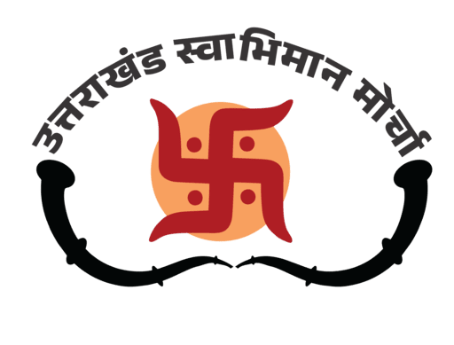

    

<h1 align="center">Uttarakhand Swabhiman Morcha   उत्तराखंड स्वाभिमान मोर्चा  (UMS)</h1>

उत्तराखंड स्वाभिमान मोर्चा" एक जनआधारित आंदोलन है, जो उत्तराखंड की अस्मिता, पहचान और मूल निवासी अधिकारों की रक्षा के लिए निरंतर संघर्षरत है। 
उत्तराखंड स्वाभिमान मोर्चा राज्य के प्रत्येक नागरिक के आत्मसम्मान, अधिकार और पहचान को पुनर्स्थापित करने की एक जनआंदोलन-प्रेरित पहल है। यह संगठन मात्र एक राजनीतिक विकल्प नहीं, बल्कि एक जनभावना है – जो राज्य की जड़ों, संस्कृति और अस्मिता से गहराई से जुड़ी है।

**UMS** is a citizen-centric Android application designed to amplify the voice of Uttarakhand’s people. It aims to preserve the cultural identity, ensure the rights of native residents, and promote transparent governance through active public engagement.

---

## 📱 App Overview

UMS is not just an app — it’s a movement. Built as a digital platform for the **Uttarakhand Swabhiman Morcha**, the app helps every Uttarakhandi participate in protecting their identity, reporting local issues, and accessing verified information that affects their community.

---

## 🌟 Features

- 🔔 **Real-time Updates** – Stay informed about the latest activities, decisions, and announcements by the Morcha.
- 📝 **Complaint System** – Submit complaints (with or without registration), track their status, and help build local accountability.
- 📷 **Image & Document Uploads** – Attach photos and PDFs with complaints.
- 🔐 **User Registration/Login** – Secure login system to manage your submissions and data.
- 🎯 **About UMS** – Learn about the mission, vision, and values of Uttarakhand Swabhiman Morcha.

---

## 🪟 Screensort
| Login Screen | Registration | Profile |
|--------------|--------------|---------|
| ![Login] | ![Register] | ![Profile]
|

| Home Screen | Navigation | Write Complaint for authenticate user |
|--------------|--------------|---------|
| ![Home] | ! |  | 

| About Us | Share | Write Complaint for anonymous user  |
|--------------|--------------|---------|
|  |  | 

---

## 🛠️ Tech Stack

- **Language**: Kotlin
- **Architecture**: MVVM (Model-View-ViewModel)
- **Database**: Firebase Firestore, Room (for local storage)
- **Image Upload**: Firebase Storage
- **Dependency Injection**: Hilt
- **UI/UX**: XML, Material Design,
- **Others**: Coil, Firebase Authentication, Internet Handling
 ---

 ## 📥 Download

The app is available for download in the [Releases Section](https://github.com/Rahul-JoshiG/Uttarakhand_Swabhiman_Morcha/releases).

---

## 📧 Contact

For inquiries or feedback, please contact:  
- **Developer**: _Rahul Joshi_
- **Email**: _[prof.rahuljoshi@gmail.com](mailto:prof.rahuljoshi@gmail.com)_

---
